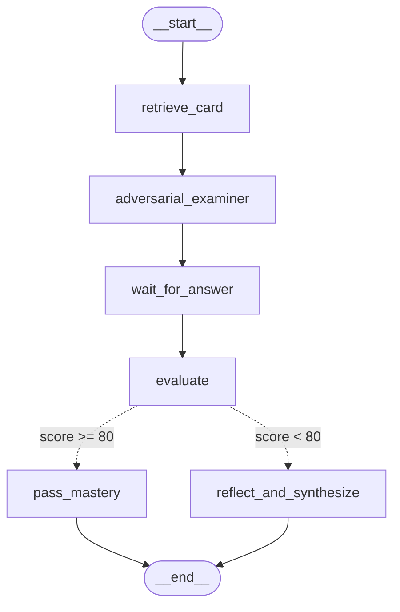

# 408-MasteryGraph: 考研408攻防审题与自省闭环教练智能体

> **《Hello Agents》第六章 框架开发实践 · 原创打卡 Demo**  
> 核心框架：**LangGraph + OpenAI SDK**  
> 领域背景：结合考研 408 核心知识卡片库，构建具备**真题攻防出题、动态采分裁判、条件分支诊断与结构化防坑闪卡反思自愈闭环**的严谨考研智能体。

---

## 🌟 项目亮点与设计哲学 (Why It's Not Just a Chatbot)

普通的 Agent Demo 往往只是简单套一个 Prompt 模板进行单轮问答。而在严谨的 408 考研备考场景下，这种“一问一答”极易产生幻觉，且对考生没有实质性的思维提升。

**408-MasteryGraph** 深度整合了本地考研卡片数据库（`ky_cards_rebuild`），利用 **LangGraph 状态机**构建了工业级闭环流程：
1. **真实数据底座（Grounding）**：直接检索 `E:\document\project\GenericAgent\GenericAgent\temp\projects\工具开发\ky_cards_rebuild` 的成套 JSON 考点卡片。
2. **攻防变式命题（Adversarial Formulation）**：严禁照抄题面，而是针对知识点中的易错陷阱（如“主频越高一定越快”、“MIPS悖论”、“动态指令数与时间倒挂”等）原创情境辨析题。
3. **细分裁判与条件路由（Conditional Branching）**：
   - 考题带有精确的采分标准（Rubric）与暗雷细则；
   - 评测得分 $\ge 80$ 分：判定为掌握，路由流转至 `pass_mastery` 节点；
   - 评测得分 $< 80$ 分：判定存在认知死角，条件分支自动触发 `reflect_and_synthesize` 自愈节点。
4. **反思沉淀与飞轮迭代（Self-Reflection & Card Growth）**：
   - 针对考生的失分诊断，自动反思生成一份结构化专属“避坑指南闪卡（Trap Guide Flashcard）”；
   - 将新闪卡持久化追加沉淀到本地 `my_generated_cards.json`，形成“做错一次，终身防坑”的学习飞轮。

---

## 🏗️ 状态图拓扑 (LangGraph Topology)

系统内部状态拓扑由 LangGraph 编译生成，可直接使用 Mermaid 渲染：



---

## 📁 目录结构

```text
code/chapter6/Demo/
├── .env                     # 环境变量配置文件（API Key, Base URL, 模型等）
├── graph_topology.mmd       # LangGraph 导出的真实 Mermaid 状态拓扑图
├── ky_mastery_agent.py      # 主程序（基于 LangGraph 的核心状态图实现）
├── server.py                # 一体化全栈 Web 服务（托管前端卡片站 + Agent 攻防审题裁判 API）
├── web/                     # 完整 408 考研记忆卡片前端（移植自 ky_cards_rebuild，406张卡片）
│   ├── index.html           # 客户端页面（集成 KaTeX 公式渲染与 Agent 悬浮教练）
│   └── assets/              # 前端编译包、KaTeX 字体、样式库与 cards_db.json
├── my_generated_cards.json  # 自动沉淀的易错反思闪卡库（持久化存储）
└── README.md                # 项目文档与运行指南
```

---

## 🚀 快速开始与运行

### 方式一：一键启动全栈 Web 记忆卡片与 Agent 攻防教练系统（推荐）

直接启动一体化 Web 服务，即可在浏览器中享受完整的 React + KaTeX 408 卡片刷题体验，并随时呼出 LangGraph 智能攻防教练进行命题、答题、阅卷与自愈：

```bash
# 进入 Demo 目录
cd E:\document\project\hello-agents-hw\code\chapter6\Demo

# 启动服务（默认监听 8088 端口）
python server.py 8088
```

然后在浏览器打开：[http://127.0.0.1:8088](http://127.0.0.1:8088)
- **406张核心考点卡片库**：数据结构（134张）、组成原理（94张）、操作系统（92张）、计算机网络（86张），支持艾宾浩斯复习流、公式渲染、搜索筛选；
- **智能攻防教练悬浮窗**：点击右下角「🤖 攻防教练」，即可一键随机抽取考点让 Agent 命题。在输入框键入作答后，一键提交由 LangGraph 裁判阅卷并生成反思避坑卡片！

---

### 方式二：命令行纯交互模式 (CLI Mode)

如果只需在终端单测状态图逻辑，可直接运行：

```bash
python ky_mastery_agent.py
```
```bash
conda activate ai-agent
```

### 2. 交互式实战演练（人机对战模式）
直接运行主程序，指定科目（如 `co` 计组、`os` 操作系统、`ds` 数据结构、`net` 计网）与想要专项突破的考点：
```bash
python ky_mastery_agent.py --subject co --topic metrics
```
系统将为你出题并等待你在终端输入答案，给出即时裁决。

### 3. 自动化测试模式（Mock Answer）
支持直接传入预设作答，一键体验完整的攻防诊断与新卡片生成流程：
```bash
python ky_mastery_agent.py --subject co --topic metrics --mock-answer "CPU时间由主频决定。主频越高速度一定越快，MIPS越高说明计算机性能一定更强。"
```

---

## 🎯 效果实录示例

### 命题官攻防试题
> **【试题】** 某系统设计团队拟对现有处理器进行架构升级，提出了两种优化方案：
> - 方案甲：提升时钟主频 20%，其余设计保持不变；
> - 方案乙：优化编译器与指令译码逻辑，使程序运行时的指令总数减少 30%，但由于增加了复杂指令，平均 CPI 上升了 10%，主频保持不变。
> 
> 请回答：
> 1. 根据性能衡量准则，哪个方案在执行同一程序时的实际性能提升更大？
> 2. 评判方案乙时，某工程师称“该方案的 MIPS 指标必然提高”，该说法是否正确？请结合公式给出严格分析。

### 裁判阅卷诊断 (Score: 20/100)
> 考生踩中了命题人预设的典型“主频崇拜”与“MIPS 悖论”陷阱：
> 1. 忽略了影响 CPU 执行时间的铁三角要素（$IC \times CPI \times T_c$）；
> 2. 误将 MIPS 等同于计算机绝对性能，实际上 MIPS 随 CPI 升高可能出现“性能提升但 MIPS 下降”的倒挂反常现象。

### 自动沉淀的防坑闪卡 (`my_generated_cards.json`)
```json
{
  "id": "co-trap-mips-fallacy",
  "type": "trap_guide",
  "kp": "co-overview-00-metrics-防坑卡",
  "front": "【真伪辨析】①“MIPS 越高，程序运行越快”；②“主频越高，CPU 执行时间越短”。这两个结论是否正确？为什么会出现“程序跑得更快，MIPS 反而更低”的现象？",
  "back": "### 核心结论：两个观点均不正确！\n衡量性能的唯一绝对标准是 CPU 执行时间！\n性能铁三角公式：CPU 执行时间 = (IC * CPI) / f\nMIPS = f / (CPI * 10^6)\n典型反例：编译器优化消除大量低 CPI 的简单指令后，程序总时间缩短（性能变强），但加权平均 CPI 上升，导致 MIPS 倒挂暴跌！\n口诀：性能铁三角，时间是国王；砍掉快指令，CPI 反暴涨；程序跑得飞起，MIPS 却掉一地。"
}
```
